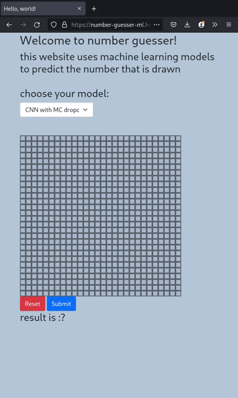

# Digit Recognition with Deep Learning

## Introduction 
this is an end to end machine learning project to recognize hand written digits.  
the user can draw any number and the website will return the guessed number.
you can try the application on this website. https://number-guesser-ml.herokuapp.com/.  

the application is divided into three main components:
- Deep learning & Machine learning models (built with **Tensorflow** and **sklearn**)
- Machine learning server (deployed on azure)
- user server where the frontend content is served (deployed on heroku)

here is a simple video demo:  

## Preparing Machine Learning Models
exploring the data with visualization:

<!-- [notebook](https://colab.research.google.com/drive/1yIq5ptKeYqMAkDmZjFTM-9qGPOhC91_Z?usp=sharing) -->

deep learning models:

<!-- [notebook](https://colab.research.google.com/drive/1nGez-o9NFYIoFTjE5kB33fdckVb-Gnkx?usp=sharing) -->

classic ML models (random forests, knn...):

<!-- [notebook](https://colab.research.google.com/drive/1VBph2s2Yvh5xs6E_cKsT7mNQRMlKwqEu?usp=sharing) -->

## Machine Learning Server
this is a **Django** API server that receives the drawn digit and returns the prediction.  
the server contains the models stored in .h5 or .pkl format. The server loads these models using **Singleton design pattern**. this design pattern added a huge performance boost for big models (random forests is 900MB). the server is deployed on azure VM using their free plan. 
we can view all available models here: https://ml-server.westeurope.cloudapp.azure.com/list
the code for the server is available in the sub-directory ml_server.

## User server
user server is a simple **Django** application hosted on heroku for its free continuous delivery and easy integration with github (PaaS).  
this server only returns a html file. it is built with django for reasons of extensibility.
we can access this server on this link:  https://number-guesser-ml.herokuapp.com/
